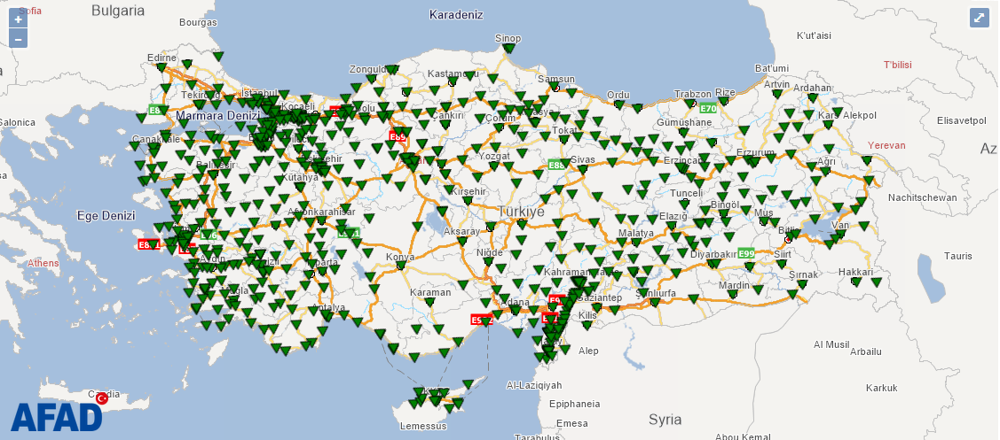
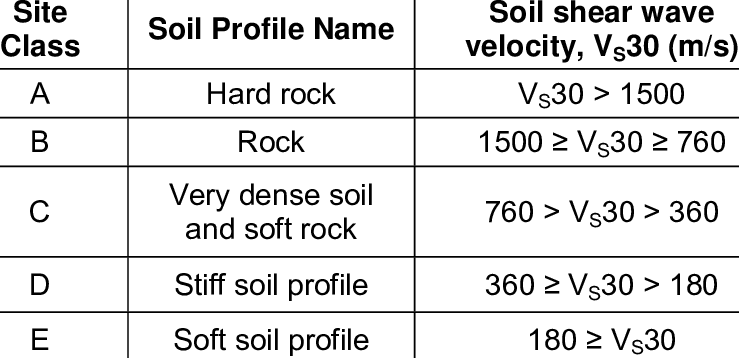
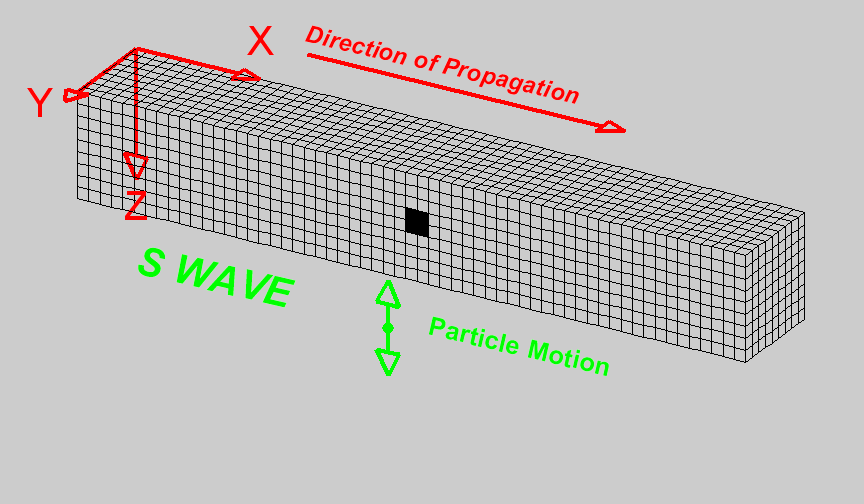
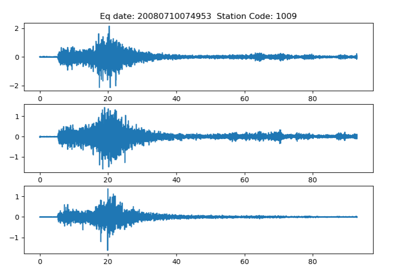
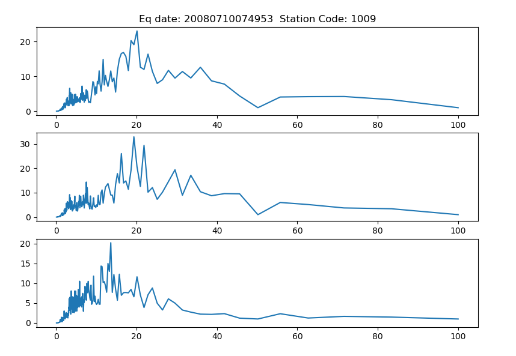
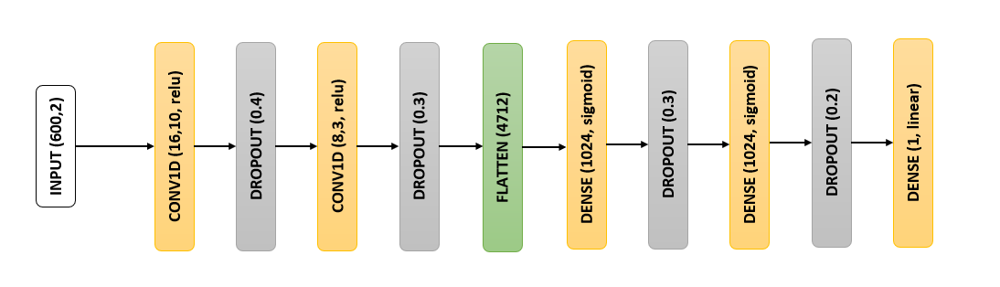

<html>
<body>

  <h1 align="center">CMP684 Project</h1>
  <h1 align="center"><strong>Vs30 Prediction from Earthquake Accelerograms</strong></h1>

  
<strong>Earthquakes are recorded with seismograph devices all over the world especially at countries with high seismicity (eg. Turkey, Japan). Records of these devices, namely accelerograms (t</strong><strong>he recording of the acceleration of the ground during an earthquake</strong><strong>), vaguely reflects some characteristics of seismograph site.</strong><strong>&nbsp;In this study, a parameter of site, average shear wave velocity of top 30 meters of soil (Vs30) predicted using accelerograms recorded at the same site with the help of a neural network.</strong>

  
<strong>
          
        </strong>

  
<strong><em>AFAD strong ground motion seismograph network [1].</em></strong>

  
In Turkey there are 679 seismograph devices actively working in AFAD's (Disaster &amp; Emergency Management Authority) strong ground motion seismograph network.&nbsp;For 68 of those 679 seismographs the geological borehole log reports are available online [2] and for 258 seismographs the Vs30 value of site is known. Vs30 is accepted as a indicator of the hardness of soil of a site. If site has rock-type properties, Vs30 is high and if site has soil-type properties Vs30 is low. An example soil classification according to Vs30&nbsp;values is shown below:

  

     
  

    
  

<em>Soil classification table according to Vs30 values [3]</em>

   

  

<em>Shear wave propagation in soil medium [4].</em>

In this study, earthquakes recorded by seismographs with known Vs30 values are used. By the date 26.11.2019 (cut-off date for data gathering) there were around 20.000 earthquake records (Magnitude ≥ 3) caught by these 258 seismographs. Each of these records have three accelerograms in three perpendicular directions (north-south (<em>ns</em>), east-west (<em>ew</em>), up-down(<em>ud</em>)). A sample record shown below.

    
  

<em>North-South, East-West and Up-Down records of earthquake recorded at station no 1009 at 2008.</em>

These records are not used directly in the training of neural network model. In order to standardize the input and to reflect the frequency dependent behavior better, accelerogram records converted to spectra using Niggam-Jennings methodology [5]. Spectra calculated for sample accelerograms are given below.

     
    
  

 
<em>Spectra calculated for North-South, East-West and Up-Down records of earthquake recorded at station no 1009 at 2008.</em>

  
Using the spectra derived from over 20.000 earthquake records a neural network model formed and trained in a way to <strong><u>extract&nbsp;</u></strong><strong><u>Vs30&nbsp;</u></strong><u><strong>value from the relation between horizontal and vertical components of earthquake recordings.</strong></u> Thus North-South_Up-Down (<em>ns-ud</em> ) and East-West_Up-Down (<em>ew-ud</em> ) spectrum couples used as input and&nbsp;Vs30&nbsp;value used as output.&nbsp;

  
<u><strong>Neural Network Model</strong></u>

  
Schematic of neural network model is given below:

  

      &nbsp; 
    <em>&nbsp;Neural network model used in this study.</em>

 
  

     
  

This study done by&nbsp;Ali AKGÖZ (
  <a href="mailto:aliakgoz@gmail.com">aliakgoz@gmail.com</a>)&nbsp;as a term project for 
    <a href="https://web.cs.hacettepe.edu.tr/~onderefe/bil684/" rel="noopener noreferrer" target="_blank">CMP684 - Neural Networks Course</a> (Hacettepe University - Computer Engineering) under supervision of the instructor of the course 
    <a href="https://web.cs.hacettepe.edu.tr/~onderefe/" rel="noopener noreferrer" target="_blank">Prof. Dr. M.Önder EFE</a>.&nbsp;
  

   

   

<strong>References:</strong>

[1] 
  <a href="https://deprem.afad.gov.tr/istasyonlar">https://deprem.afad.gov.tr/istasyonlar</a> &nbsp;

[2] 
  <a href="http://kyhdata.deprem.gov.tr/">http://kyhdata.deprem.gov.tr/</a>&nbsp; (currently unavailable due to maintenance. 17.03.2020)&nbsp;

[3] Building Seismic Safety Council, NEHRP Recommended Provisions for Seismic Regulations for New Buildings and Other Structures (Fema 450)," Part 1, no. Fema 450, p. 338, 2003.

[4] 
  <a href="https://web.ics.purdue.edu/~braile/edumod/waves/Swave.gif">https://web.ics.purdue.edu/~braile/edumod/waves/Swave.gif</a> &nbsp;

[5] N. Nigam, P. Jennings, and C. I. of Technology Earthquake Engineering Research Laboratory, Digital calculation of response spectra from strong-motion earthquake records. California Institute of Technology, Earthquake Engineering Research Laboratory, 1968

</body>
</html>